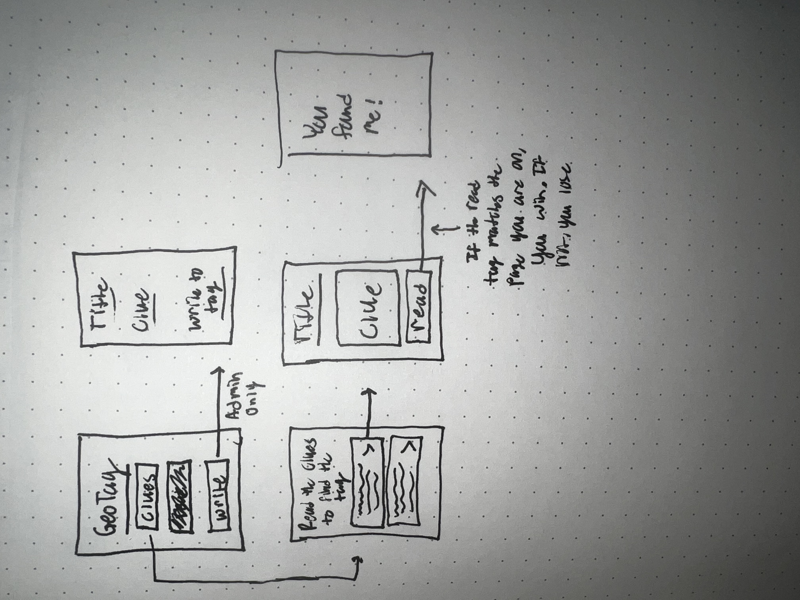

# Welcome to Geo Tag

Geo Tag is an application that mimics the activity of geocaching. Admins have the ability to create new Geo Tags that contain a name and a hint on how to find the tag. Users can view a full list of all Geo Tags along with their hints. The user may select a Geo Tag they would like to find, and upon successfully discovering the Geo Tag using the hint, they can scan the tag to verify they found the correct one!

# How to Use App

This app utilizes the NFC functionality of mobile phones. Because of this, it is required that it be ran under a development build. For me, I run the built application on XCode, and then pair that with the command "npx expo start --dev-client" in my terminal under my projects directory.

# Wireframe

# Human Interface Guidelines

After reading about Human Interface Guidelines, I've seen how important they can be to the user experience. In this application I tried following a few HIG components from the Apple documentation.

Buttons are important to the user experience. Apple recommends that developers use buttons that can 'associate familiar actions with familiar icons'. However, the actions required in my application are not completely intuitive. That is why I followed the direction of "using text/short labels to communicate more clearly than an icon". This app requires a few specific actions that are not immediately recognizable, which is why I used short text on my buttons.

With the multitude of information in this application, I sought to follow the 'Layout and Organization > Boxes' best practices. On pages where lots of content is shown (i.e. Geo Tag List, Search for Geo Tag), I split different components into their own boxes to help separate concerns.

Lastly, the best practice of using 'Search Fields' is utilized on my Geo Tag List page to, as Apple HIG recommends, start search immediately when a person types. Meaning it starts filtering the list of Geo Tags as the user types, without having to click a search button.
